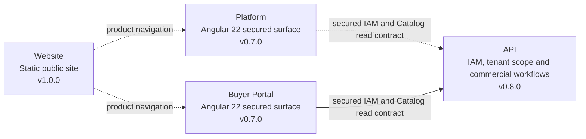

<div align="center">


# Nexa Buyer Portal

Buyer-facing B2B workspace for catalog discovery, purchase requests, orders, delivery visibility and account self-service.

[](https://angular.dev/) [](https://www.typescriptlang.org/) [](https://material.angular.dev/) [](https://github.com/nexa-suite/portal/releases/tag/v0.7.0)

[Changelog](./CHANGELOG.md) · [Release notes](./docs/releases/) · [Contributing](./.github/CONTRIBUTING.md) · [Security](./.github/SECURITY.md)

**Current repository:** Portal · **Latest published release:** `v0.7.0` · **Development version:** `0.7.1`

[Website](https://github.com/nexa-suite/website) · [Platform](https://github.com/nexa-suite/platform) · [Portal](https://github.com/nexa-suite/portal) · [API](https://github.com/nexa-suite/api) · [Mobile](https://github.com/nexa-suite/mobile)

</div>

---

## What is implemented

`v0.7.0` packages Angular 22 Buyer access foundations, Product Catalog discovery/detail, Purchase Request and Sales Order flows, plus Buyer-safe delivery tracking.

Current `develop` artifact `0.7.1` contains development stabilization for availability states, delivery tracking and recoverable loading/error/retry states. This material is not a published release.

Portal is the buyer experience and is separate from internal Platform. This release integrates the secured Buyer IAM/session/catalog read contract with the API; broader buyer workflows, persistence beyond the API contract and production deployment are not implemented here.

## Product boundaries



The Portal link is the approved secured vertical slice for this release. Mobile is not implemented and is intentionally absent from the runtime map. PostgreSQL, AI, IoT and cloud services remain outside this frontend release.


## Repository map

| Repository | Latest published release | Responsibility | Evidence status |
|---|---:|---|---|
| [Website](https://github.com/nexa-suite/website) | `v1.0.0` | Static public product discovery | Released static site |
| [Platform](https://github.com/nexa-suite/platform) | `v0.7.0` | Internal operations shell | Angular 22 secured commercial, Warehouse and Logistics surface; Docker runtime |
| **Portal** | **`v0.7.0`** | Buyer self-service shell | Angular 22 secured commercial and delivery surface; Docker runtime |
| [API](https://github.com/nexa-suite/api) | `v0.8.0` | Business and integration authority | IAM, tenant scope, commercial, Warehouse and Logistics workflows |
| [Mobile](https://github.com/nexa-suite/mobile) | `v0.1.1` | Future native clients | Documentation-only |

## Bounded contexts

| Area | Current maturity |
|---|---|
| IAM | Secured client/API slice |
| Catalog Management | Secured read slice; shared local reference seed |
| Sales from buyer perspective | Purchase Request builder and self-service lifecycle |
| Logistics tracking | Buyer delivery tracking in `v0.7.0` |
| Invoicing documents and payments | Planned |

## Architecture

Presentation depends on Application. Application depends on Domain. Infrastructure remains outside Domain. Buyer-facing models and API adapters require an approved vertical slice and an explicit contract; Portal does not own internal administration or backend business rules.

## Tech stack

Angular 22, TypeScript strict mode, Angular Material/CDK 22, Signals, RxJS, `ngx-translate` 18, SCSS and npm 11.17.0 as declared by `package.json`.

## Getting started

```bash
npm ci
npm start
```

Open [http://localhost:4300](http://localhost:4300) and navigate to `/home`.

## Available commands

```bash
npm run validate:catalog-assets
npm test
npm run build
```

## Project structure

```text
src/app/core/                                      # Shell, routes and language service
src/app/shared/presentation/components/            # Reusable visual components
src/app/shared/application/utilities/              # Pure address, date and number utilities
public/catalog-items/                              # Manifest-validated canonical media subset
src/styles/                                        # Tokens, typography, motion, Material and a11y
docs/assets/repository-map/                        # Local architecture map
docs/releases/                                     # Versioned release notes
```

## Documentation

- [Release notes index](./docs/releases/)
- [Release policy](./.github/RELEASE_POLICY.md)

## Roadmap boundary

Future buyer vertical slices require explicit contracts, buyer identity, tenant rules and runtime/browser evidence. Planned database, AI, IoT, cloud and mobile capabilities must not be described as Portal implementation until those gates pass.
