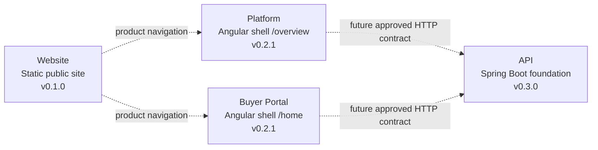
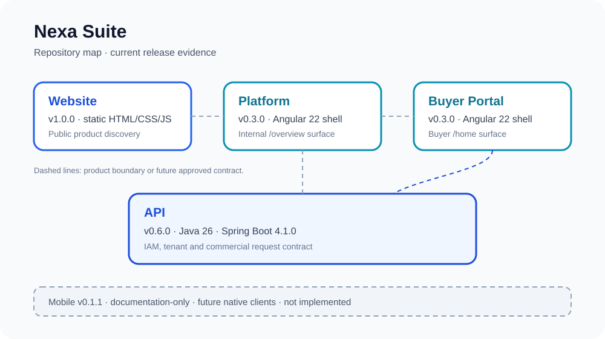

<div align="center">


# Nexa Buyer Portal

Buyer-facing B2B workspace for catalog discovery, purchase requests, orders, delivery visibility and account self-service.

[](https://angular.dev/) [](https://www.typescriptlang.org/) [](https://material.angular.dev/) [](https://github.com/nexa-suite/portal/releases/tag/v0.2.1)

[Changelog](./CHANGELOG.md) · [Release notes](./docs/releases/) · [Contributing](./.github/CONTRIBUTING.md) · [Security](./.github/SECURITY.md)

**Current repository:** Portal · **Current release:** `v0.2.1`

[Website](https://github.com/nexa-suite/website) · [Platform](https://github.com/nexa-suite/platform) · [Portal](https://github.com/nexa-suite/portal) · [API](https://github.com/nexa-suite/api) · [Mobile](https://github.com/nexa-suite/mobile)

</div>

---

## What is implemented

`v0.2.1` is a repository experience and governance release. The current application is an Angular 22 buyer shell with the `/home` route, reusable presentation components, EN/ES language support, catalog asset validation and focused tests.

Portal is the buyer experience and is separate from internal Platform. Buyer workflows, API integration, authentication, authorization, tenant management, persistence and production deployment are not implemented in this release.

## Product boundaries



The dotted links are boundaries for future approved contracts, not evidence of current API integration. Mobile is not implemented and is intentionally absent from the runtime map. PostgreSQL, AI, IoT and cloud services are not implemented in this release.



## Repository map

| Repository | Current release | Responsibility | Evidence status |
|---|---:|---|---|
| [Website](https://github.com/nexa-suite/website) | `v0.1.0` | Static public product discovery | Released static site |
| [Platform](https://github.com/nexa-suite/platform) | `v0.2.1` | Internal operations shell | Angular `/overview` shell |
| **Portal** | **`v0.2.1`** | Buyer self-service shell | Angular `/home` shell |
| [API](https://github.com/nexa-suite/api) | `v0.3.0` | Business and integration authority | Catalog domain foundation |
| [Mobile](https://github.com/nexa-suite/mobile) | `v0.1.0` | Future native clients | Documentation-only |

## Bounded contexts

| Area | Current maturity |
|---|---|
| IAM | Foundation shell / implementation planned |
| Catalog Management | Foundation shell / API foundation exists |
| Sales from buyer perspective | Planned |
| Logistics tracking | Planned |
| Invoicing documents and payments | Planned |

## Architecture

Presentation depends on Application. Application depends on Domain. Infrastructure remains outside Domain. Buyer-facing models and API adapters require an approved vertical slice and an explicit contract; Portal does not own internal administration or backend business rules.

## Tech stack

Angular 22, TypeScript strict mode, Angular Material/CDK 22, Signals, RxJS, `ngx-translate` 18, SCSS and npm 11.17.0 as declared by `package.json`.

## Getting started

```bash
npm ci
npm start
```

Open [http://localhost:4300](http://localhost:4300) and navigate to `/home`.

## Available commands

```bash
npm run validate:catalog-assets
npm test
npm run build
```

## Project structure

```text
src/app/core/                                      # Shell, routes and language service
src/app/shared/presentation/components/            # Reusable visual components
src/app/shared/application/utilities/              # Pure address, date and number utilities
public/catalog-items/                              # Manifest-validated canonical media subset
src/styles/                                        # Tokens, typography, motion, Material and a11y
docs/assets/repository-map/                        # Local architecture map
docs/releases/                                     # Versioned release notes
```

## Documentation

- [Release notes index](./docs/releases/)
- [Release policy](./.github/RELEASE_POLICY.md)

## Roadmap boundary

Future buyer vertical slices require explicit contracts, buyer identity, tenant rules and runtime/browser evidence. Planned database, AI, IoT, cloud and mobile capabilities must not be described as Portal implementation until those gates pass.
